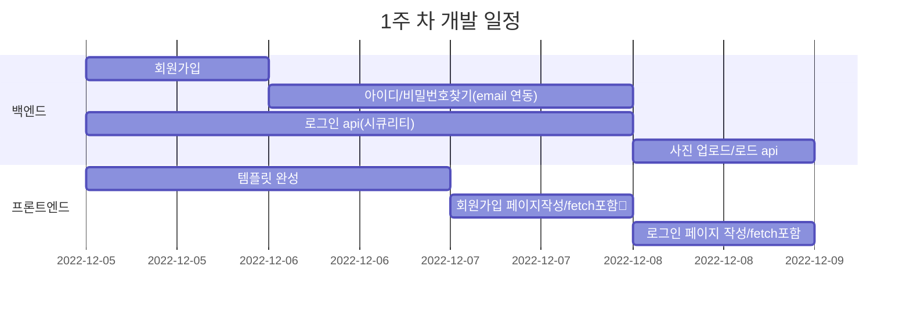

## ⚠️ 참고사항
- 기본적으로 백엔드 api가 완성되면 프론트페이지가 따라오는 형식으로 들어갑니다
- 또한 프론트페이지가 먼저 작성되어도 디스코드 상의 후 필요한기능 리스트업후 진행합니다
- 토요일은 기능 정리 + 다음 주에 개발할 내용을 디스코드로 상의합니다
- 일요일은 정리 + 다음 주 일정 준비 + 휴식기간으로 들어갑니다 
## 📅 1주 차
- 회원 위주의 기능으로 개발 시작합니다
- 자주 쓰일 이미지 기능을 마지막으로 넣고 시간이 부족하다면 다음 주로 넘깁니다

